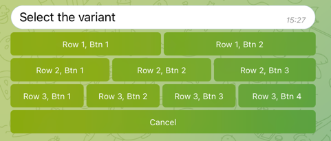

# Inline Keyboard



## Getting Started

```go
package main

import (
	"context"
	"os"
	"os/signal"

	"github.com/go-telegram/bot"
	"github.com/go-telegram/bot/models"
	"github.com/go-telegram/ui/keyboard/inline"
)

func main() {
	ctx, cancel := signal.NotifyContext(context.Background(), os.Interrupt)
	defer cancel()

	telegramBotToken := os.Getenv("EXAMPLE_TELEGRAM_BOT_TOKEN")

	opts := []bot.Option{
		bot.WithDefaultHandler(defaultHandler),
	}

	b := bot.New(telegramBotToken, opts...)

	b.Start(ctx)
}

func defaultHandler(ctx context.Context, b *bot.Bot, update *models.Update) {
	kb := inline.New(b).
		Row().
		Button("Row 1, Btn 1", []byte("1-1"), onInlineKeyboardSelect).
		Button("Row 1, Btn 2", []byte("1-2"), onInlineKeyboardSelect).
		Row().
		Button("Row 2, Btn 1", []byte("2-1"), onInlineKeyboardSelect).
		Button("Row 2, Btn 2", []byte("2-2"), onInlineKeyboardSelect).
		Button("Row 2, Btn 3", []byte("2-3"), onInlineKeyboardSelect).
		Row().
		Button("Row 3, Btn 1", []byte("3-1"), onInlineKeyboardSelect).
		Button("Row 3, Btn 2", []byte("3-2"), onInlineKeyboardSelect).
		Button("Row 3, Btn 3", []byte("3-3"), onInlineKeyboardSelect).
		Button("Row 3, Btn 4", []byte("3-4"), onInlineKeyboardSelect).
		Row().
		Button("Cancel", []byte("cancel"), onInlineKeyboardSelect)

	b.SendMessage(ctx, &bot.SendMessageParams{
		ChatID:      update.Message.Chat.ID,
		Text:        "Select the variant",
		ReplyMarkup: kb,
	})
}

func onInlineKeyboardSelect(ctx context.Context, b *bot.Bot, mes *models.Message, data []byte) {
	b.SendMessage(ctx, &bot.SendMessageParams{
		ChatID: mes.Chat.ID,
		Text:   "You selected: " + string(data),
	})
}
```

## Options

See in [options.go](options.go) file 
