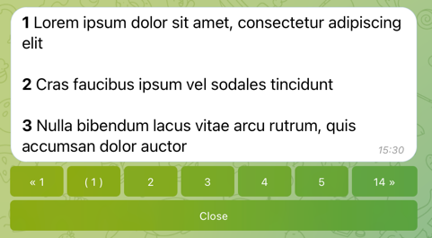

# Paginator



## Getting Started

```go
package main

import (
	"context"
	"os"
	"os/signal"
	"strconv"

	"github.com/go-telegram/bot"
	"github.com/go-telegram/bot/models"
	"github.com/go-telegram/ui/paginator"
)

var (
	data = []string{
		"*1* Lorem ipsum dolor sit amet, consectetur adipiscing elit",
		"*2* Cras faucibus ipsum vel sodales tincidunt",
		"*3* Nulla bibendum lacus vitae arcu rutrum, quis accumsan dolor auctor",
		"*4* Morbi non mi nec nulla rutrum aliquet",
		"*5* Curabitur quis leo facilisis, vulputate sem id, euismod mauris",
		"*6* Sed condimentum tellus in diam dapibus, in euismod nisi ornare",
		"*7* Quisque ut neque congue, blandit orci vitae, viverra mi",
		"*8* Suspendisse porttitor erat in hendrerit pulvinar",
		"*9* Suspendisse cursus arcu placerat auctor vehicula",
		"*10* Phasellus tempus nisi a urna luctus aliquam",
		"*11* Morbi volutpat tellus placerat molestie ultricies",
		"*12* Nulla at est eu eros luctus eleifend ut nec lorem",
		"*13* Praesent suscipit nibh vel nisl feugiat, et dignissim dolor feugiat",
		"*14* Mauris nec tellus vitae dolor dictum malesuada eget eget felis",
		"*15* Aenean non turpis eu tellus tristique faucibus vitae vitae nisi",
		"*16* Sed id urna sit amet est bibendum pellentesque id dictum urna",
		"*17* Etiam auctor velit quis enim blandit convallis",
		"*18* Pellentesque ut augue eget est tempor dapibus",
		"*19* In hendrerit enim et dignissim iaculis",
		"*20* Etiam eu nibh dignissim, blandit lectus sit amet, euismod libero",
		"*21* Pellentesque aliquam lorem a erat consectetur, ornare facilisis justo laoreet",
		"*22* Vestibulum rhoncus leo mollis blandit vehicula",
		"*23* Etiam maximus ante nec mi euismod, ac finibus arcu congue",
		"*24* Nulla consectetur velit id turpis vehicula viverra",
		"*25* Vivamus dignissim arcu vitae nisl dignissim maximus",
		"*26* Sed euismod tellus sit amet suscipit vehicula",
		"*27* Donec eu tortor pulvinar, vulputate diam sit amet, aliquam turpis",
		"*28* Donec interdum risus bibendum aliquam venenatis",
		"*29* Proin quis tellus in risus interdum iaculis vitae mattis ante",
		"*30* Duis ac tortor ultrices, tempor enim id, auctor sem",
		"*31* Nulla lacinia elit vel nunc aliquet, sit amet vulputate ligula dictum",
		"*32* Phasellus semper nibh aliquet orci viverra aliquet",
		"*33* Praesent id felis non purus fringilla placerat in at lacus",
		"*34* Aenean id felis ut tellus fringilla egestas volutpat sed arcu",
		"*35* Nunc varius magna in scelerisque commodo",
		"*36* Nunc sed orci nec lacus sodales molestie in in metus",
		"*37* Fusce a ipsum fermentum, egestas ex sit amet, ultricies libero",
		"*38* Quisque ullamcorper orci vel ligula posuere iaculis",
		"*39* Pellentesque non orci pellentesque felis consequat varius",
		"*40* Maecenas id mauris scelerisque, elementum elit et, rutrum felis",
	}
)

func main() {
	ctx, cancel := signal.NotifyContext(context.Background(), os.Interrupt)
	defer cancel()

	telegramBotToken := os.Getenv("EXAMPLE_TELEGRAM_BOT_TOKEN")

	opts := []bot.Option{
		bot.WithDefaultHandler(defaultHandler),
	}

	b := bot.New(telegramBotToken, opts...)

	b.Start(ctx)
}

func defaultHandler(ctx context.Context, b *bot.Bot, update *models.Update) {
	opts := []paginator.Option{
		paginator.PerPage(3),
		paginator.WithCloseButton("Close"),
	}

	p := paginator.New(data, opts...)

	p.Show(ctx, b, strconv.Itoa(update.Message.Chat.ID))
}
```

## Options

See in [options.go](options.go) file 
