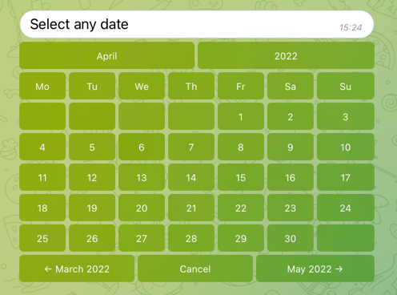
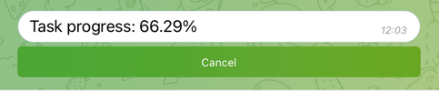
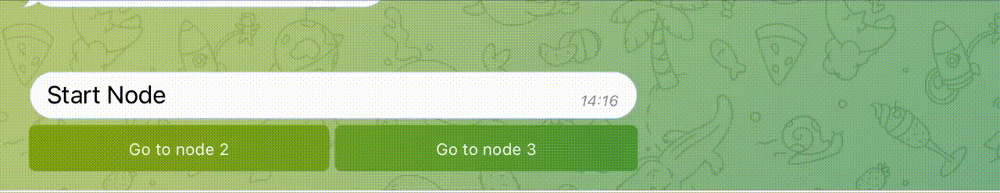

# Go Telegram Bot UI

> The project is under development. API may be changed before v1.0.0 version.

> [Telegram Group](https://t.me/gotelegrambotui)

UI controls for telegram bot [go-telegram/bot](https://github.com/go-telegram/bot)

- datepicker
- inline keyboard
- reply keyboard
- paginator
- slider
- progress
- dialog
- timepicker (todo)

Feel to free to contribute and issues!

## Getting Started

```bash
go get github.com/go-telegram/bot
go get github.com/go-telegram/ui
```

**Important**

UI components register own bot handlers on init. 
If you restart the bot instance, inline buttons in already opened components can't work.

For solving this issue, you should use `bot.WithPrefix` option for instance of widgets.

Example:

```go
picker := datepicker.New(
    b, 
    onDatepickerSimpleSelect, 
    datepicker.WithPrefix("datepicker-simple"),
)
```

### Live demo

You can run demo bot from `examples` folder.

Before start, you should set `EXAMPLE_TELEGRAM_BOT_TOKEN` environment variable to your bot token.

```go
    go run examples/*.go
```

Also, you can try [online version of this bot](https://t.me/gotelegramuidemobot) right now.

## DatePicker



- custom localizations
- define include/exclude dates

[Documentation](datepicker/readme.md)

## Inline Keyboard


Small helper for easy building of inline keyboard.


## Reply Keyboard


Small helper for easy building of a reply keyboard markup.

## Paginator


- pass any slice of strings
- set perPage value
- set custom lines separator

[Documentation](paginator/readme.md)

## Slider


- pass slides with images and text

[Documentation](slider/readme.md)

## Progress



Progress bar for long tasks

[Documentation](progress/readme.md)

## Dialog



Simple dialogs

[Documentation](dialog/readme.md)
