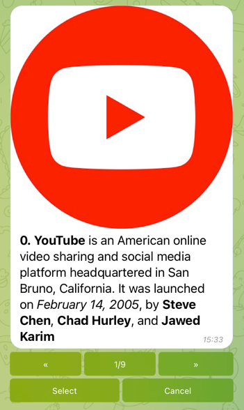

# Paginator



## Getting Started

```go
package main

import (
	"context"
	"os"
	"os/signal"
	"strconv"

	"github.com/go-telegram/bot"
	"github.com/go-telegram/bot/models"
	"github.com/go-telegram/ui/slider"
)

func main() {
	ctx, cancel := signal.NotifyContext(context.Background(), os.Interrupt)
	defer cancel()

	telegramBotToken := os.Getenv("EXAMPLE_TELEGRAM_BOT_TOKEN")

	opts := []bot.Option{
		bot.WithDefaultHandler(defaultHandler),
	}

	b := bot.New(telegramBotToken, opts...)

	b.Start(ctx)
}

func defaultHandler(ctx context.Context, b *bot.Bot, update *models.Update) {
	slides := []slider.Slide{
		{
			Text:  "*0\\. YouTube* is an American online video sharing and social media platform headquartered in San Bruno, California\\. It was launched on _February 14, 2005_, by *Steve Chen*, *Chad Hurley*, and *Jawed Karim*",
			Photo: "AgACAgIAAxkBAAO6YmF_Z9yAfUWldGLLKi1Urz9C-TYAAs67MRtwRhFLgH_zopol78cBAAMCAANzAAMkBA",
		},
		{
			Text:  "*1\\. VK* \\(short for its original name VKontakte; Russian: ВКонтакте, meaning InContact\\) is a Russian online social media and social networking service based in *Saint Petersburg*",
			Photo: "AgACAgIAAxkBAAPAYmGBRNtafgABrZ2aldPsFzddkY_sAALWuzEbcEYRS3zTgjyXacqwAQADAgADcwADJAQ",
		},
		{
			Text:  "*2\\. Skype* is a proprietary telecommunications application operated by Skype Technologies, a division of *Microsoft*, best known for VoIP\\-based videotelephony, videoconferencing and voice calls",
			Photo: "AgACAgIAAxkBAAPCYmGBWcH4Kls8nO0tOOtvFll1R3gAAte7MRtwRhFLyCEY4pSLI8QBAAMCAANzAAMkBA",
		},
		{
			Text:  "*3\\. Reddit* \\(\\/ˈrɛdɪt\\/, stylized as reddit\\) is an American social news aggregation, web content rating, and discussion website",
			Photo: "AgACAgIAAxkBAAPEYmGBcyzFR02gbVpw70Zx_kB1Qm0AAtm7MRtwRhFLwLUyMVCSlY0BAAMCAANzAAMkBA",
		},
		{
			Text:  "*4\\. Twitter* is an American microblogging and social networking service on which users post and interact with messages known as *tweets*",
			Photo: "AgACAgIAAxkBAAPGYmGBjRDAOSinB--dnXc7wDwP7MkAAtu7MRtwRhFLs31K09kYL8cBAAMCAANzAAMkBA",
		},
		{
			Text:  "*5\\. Pinterest* is an image sharing and social media service designed to enable saving and discovery of information on the internet using images, and on a smaller scale, animated GIFs and videos, in the form of pinboards",
			Photo: "AgACAgIAAxkBAAPIYmGBovpHYPsfqQfDVo-RoTYnk4cAAt27MRtwRhFLWj59BXsormYBAAMCAANzAAMkBA",
		},
		{
			Text:  "*6\\. Instagram* is an American photo and video sharing social networking service founded by *Kevin Systrom* and *Mike Krieger*\\. In April 2012, Facebook Inc\\. acquired the service for approximately *US$1 billion* in cash and stock",
			Photo: "AgACAgIAAxkBAAPKYmGBuHVyWid7w-vCHfbr9gTBIiEAAt-7MRtwRhFLD05Sel7_-AMBAAMCAANzAAMkBA",
		},
		{
			Text:  "*7\\. LinkedIn* is an American business and employment\\-oriented online service that operates via websites and mobile apps\\. Launched on May 5, 2003",
			Photo: "AgACAgIAAxkBAAPMYmGB5ZZnzA-fmVDGeH2d7p8xfkEAAuC7MRtwRhFLnGvjK3Sf6qMBAAMCAANzAAMkBA",
		},
		{
			Text:  "*8\\. Facebook* is an American online social media and social networking service owned by Meta Platforms\\. Founded in 2004 by *Mark Zuckerberg* with fellow Harvard College students and roommates *Eduardo Saverin*, *Andrew McCollum*, *Dustin Moskovitz*, and *Chris Hughes*",
			Photo: "AgACAgIAAxkBAAPOYmGB_2yKD2BMG2IIFFA7ONY9tWUAAuG7MRtwRhFLIbkibx890csBAAMCAANzAAMkBA",
		},
	}

	opts := []slider.Option{
		slider.OnSelect("Select", true, sliderOnSelect),
		slider.OnCancel("Cancel", true, sliderOnCancel),
	}

	sl := slider.New(slides, opts...)

	sl.Show(ctx, b, strconv.Itoa(update.Message.Chat.ID))
}

func sliderOnSelect(ctx context.Context, b *bot.Bot, message *models.Message, item int) {
	b.SendMessage(ctx, &bot.SendMessageParams{
		ChatID: message.Chat.ID,
		Text:   "Select " + strconv.Itoa(item),
	})
}

func sliderOnCancel(ctx context.Context, b *bot.Bot, message *models.Message) {
	b.SendMessage(ctx, &bot.SendMessageParams{
		ChatID: message.Chat.ID,
		Text:   "Cancel",
	})
}
```

If you want to use an upload image instead preloaded image or image URL, you should to place file content to `slide.Photo` field and set `slide.IsUpload` field to `true`.

```go
slide := &slider.Slide{
    Photo: "<file_content>",
    Text: "My Image",
    IsUpload: true,    
}
```

## Options

See in [options.go](options.go) file 
